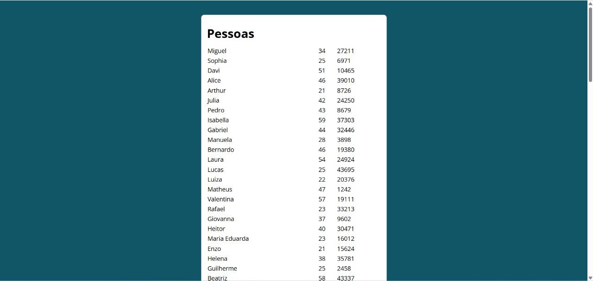

# 📡 AXIOS

## 📌 Descrição
Projeto simples que demonstra o uso da biblioteca **Axios** para realizar requisições HTTP e exibir dados de um arquivo JSON.  
Ao abrir o site, o conteúdo do arquivo **pessoas.json** é carregado e exibido na tela, mostrando apenas algumas informações selecionadas: **nome, idade e salário**.

---

## ⚙️ Funcionalidades
- Carrega dados de um arquivo `pessoas.json` usando **Axios**.  
- Exibe na página apenas os campos:
  - Nome  
  - Idade  
  - Salário  

---

## 🛠️ Tecnologias utilizadas
- **HTML5** → estrutura da página  
- **CSS3** → estilização básica  
- **JavaScript (JS)** → manipulação do DOM  
- **Axios** → biblioteca para requisições HTTP simplificadas  

---

## 📸 Preview


---

## 🚀 Como visualizar

Você pode abrir o projeto localmente:

1. Baixe ou clone este repositório:
   - Clique em **Code > Download ZIP** e extraia os arquivos  
   - ou use o comando:
     ```bash
     git clone https://github.com/WellingthonSchuh/AXIOS.git
     ```

2. Abra o arquivo `index.html` em qualquer navegador moderno.

Ou

1. Acesse o site:
   - https://wellingthonschuh.github.io/Axios/

> ⚠️ O projeto é totalmente seguro. Nenhum dado é enviado para servidores externos — os dados são carregados apenas do arquivo local `pessoas.json`.

---

## 📚 Aprendizados
- Uso da biblioteca **Axios** para requisições HTTP  
- Manipulação de dados JSON em JavaScript  
- Exibição dinâmica de informações no DOM  
- Estruturação de projetos que consomem dados externos  

---

## 👨‍💻 Autor
Feito por **Wellingthon Schuh**  
🔗 [LinkedIn](https://www.linkedin.com/in/wellingthonschuh)
